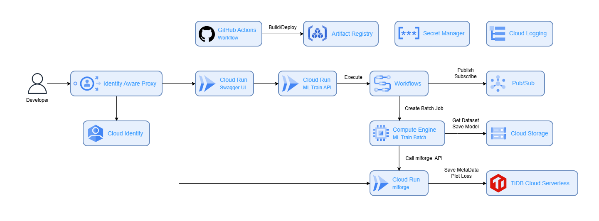

# MACH MLOps (IaC)

This is the project for building the [MACH MLOps](https://github.com/O01o/mach_mlops) infrastructure.  



## Installation

Please fork and clone this repository.  


## Usage

### Required CLIs

Please complete this setup if you haven't finished installing below yet.  
- [Google Cloud CLI](https://cloud.google.com/cli)
- [Terraform CLI](https://developer.hashicorp.com/terraform/tutorials/aws-get-started/install-cli)

### Google Cloud Project

Please create your Google Cloud account and project if you haven't setup. Do not use an existing project, please create new one.  
If you want to organize and manage your projects in a hierarchical directory structure, you may need to register a domain before. I recommend to utilize [Cloudflare DNS](https://www.cloudflare.com/ja-jp/application-services/products/dns/).  

### Setting Secrets

And before you build resources with Terraform, you need to set secrets on Google Cloud Secret Manager.  
This is managed by a project-by-project basis.  
These are the secrets you need.  

- secrets
  - DB_HOST
  - DB_PORT
  - DB_USER
  - DB_PASSWORD
  - DB_NAME
  - DB_TLS
  - DB_CA_CERT

### Setting Local Environments

Please add `terraform.tfvars` in the root of this project.  
And set the environment variables:  

```
project_id # your-google-cloud-project-000000
region # us-central1
zone # us-central1-a
name
```

### Building Resources

Finally, create the resources using the following command.  

```
terraform init
terraform plan
terraform apply
```
